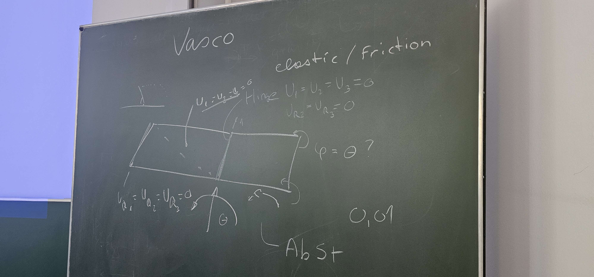
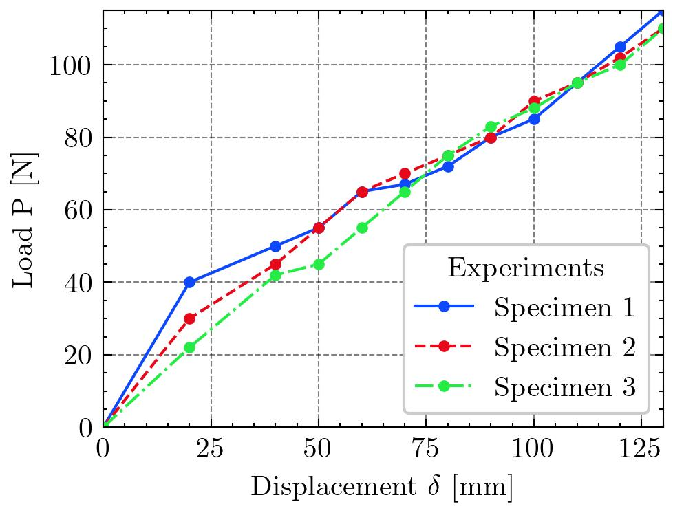

# Abaqus/Python course in the winter term 2022/23
#### Author: Vasco Pires
#### University: Montanuniversität Leoben

In this repository it can be found the homework, notes and project of the Abaqus/Python seminar from Montanuniversität Leoben. 

## Course Project: Origami Folding Boxes

### Introduction

### First steps
First, it is important that the "building blocks" of the device work. So the first step was building a simple model with two shells

Figure 1: First steps defined in class.

### Material properties

The most important material property of the model is the elastic resistance,i.e, the Young's Modulus of the rubber bands. Hence 3 tensile tests experiments were performed using the following setup:

**Figure 2**: Tensile test setup.

The results are presented in the following figure.

Figure 3: Force-displacement curves of the rubber band.  Note that the first point corresponds to the static position of the system, where the weight of the probe and resistance force are the same.

The stiffness of each specimen was obtained using linear regressions, obtaining the following results.

Table 1: 

|            | Stiffness K [N/mm] |
|------------|--------------------|
| Specimen 1 | 0.7572             |
| Specimen 2 | 0.7802             |
| Specimen 3 | 0.8241             |
| Average    | 0.7871             |

Hence, the value used for the stiffness of the rubber band is 0.7871  $\pm3.53$

Use Axial connectors and then include stiffness and reference length.
